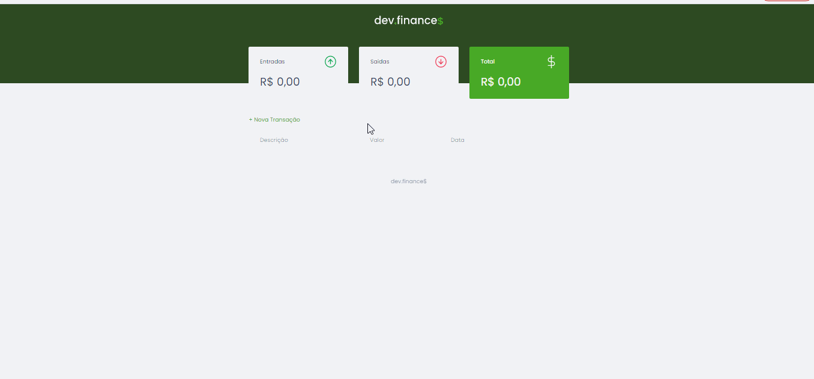

<h1 align="center">dev.finance💲</h1>
<h3 align="center"> 1ª Maratona Discover Rocketseat </h3>

### ✨ Projeto modificado

---

### 🖼️ Projeto original

### :mag: Sobre o projeto 

O dev.finance$ é uma aplicação web desenvolvida para fazer o controle de finanças pessoais básico. O projeto esta sendo desenvolvido durante a Maratona Discover, realizada pela **[@Rocketseat](https://github.com/Rocketseat)** e ministradas pelo **[Mayk Brito](https://github.com/maykbrito)** durante os dias 14, 21, 28 de janeiro e 04 de fevereiro.

### 🛠️ Tecnologias 

* HTML
* CSS
* JavaScript

### :key: Executar a aplicação

Clone este repositório
$ git clone https://github.com/raissaboeng/maratona-discover-finance.git

Acesse a pasta do projeto em seu computador e execute o arquivo index.html no navegador.

### :bulb: Melhorias
- [x] Alteração das cores do projeto;
- [x] Criação de uma tela de carregamento;
- [x] Frase de aviso no modal quando algum campo do formulário de nova transação estiver vazio;
- [x] Exibir um ícone quando não houver nenhuma transação;
- [x] Dark Mode;
- [x] Substituir as funções de adicionar e remover classes por um toogle quando possível;

Com 💜 por Raissa Boeng

